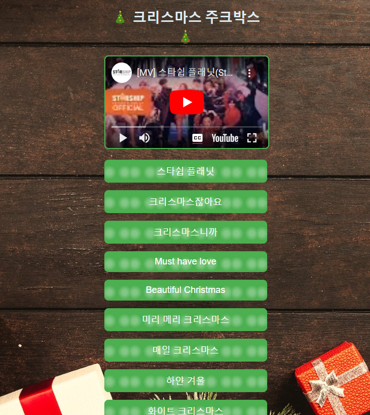

# koreanchristmasjukebox
Korean Christmas songs - 한국의 크리스마스 노래
# Christmas Jukebox
 Scrimba boot  camp project, JavaScrimptmas day 10 challenge
#Scrimba boot camp project

This is a solution to the [https://scrimba.com/learn/javascriptmas/-day-10-rockin-around-cN8mJVAm). Scrmimba is a fun and fast way of learning to code. The interactive courses and tutorials  challenges help improve coding skills by building realistic projects. Scrimba boot camp takes you from HTML basics through CSS to JavaScript, api's, React and more.

## Table of contents

- [Overview](#overview)
  - [The challenge](#the-challenge)
  - [Screenshot](#screenshot)
  - [Links](#links)
- [My process](#my-process)
  - [Built with](#built-with)
  - [What I learned](#what-i-learned)
  - [Continued development](#continued-development)
  - [Useful resources](#useful-resources)
- [Author](#author)
- [Acknowledgments](#acknowledgments)

## Overview

### The challenge

Users should be able to:

- Complete the JavaScript
- When button is clicked, the song chosen will play. 
            
- View the optimal layout for the interface depending on their device's screen size

### Screenshot

### Links

- Solution URL: (https://github.com/egpennington/koreanchristmasjukebox)
- Live Site URL: (https://seoulful-christmas-jukebox.netlify.app/)

## My process
- Scrimba gave skellton of HTML, CSS and JS start.
- Utilized JS to get songs to play on click of button.
- Then changed with own HTML, CSS.

### Built with
- Semantic HTML5 markup
- CSS 
- JavaScript

### What I learned
Learned how to utilize a fuction with an id within the function.  And that when deploying to Netlify, need to pay attention with the repository fork.

Help with writing markdown, check out [The Markdown Guide](https://www.markdownguide.org/) to learn more.

### Continued development

Continue to learn more about API's to make this more dynamic.

### Useful resources
- [Main resource 1]([https://scrimba.com/scrim/cG8EnJHv](https://scrimba.com/learn/javascriptmas/-day-10-rockin-around-cN8mJVAm)) - This helped me set up the session. Then I took it and went from scratch.

## Author

- Website - [Emmett Pennington](will be coming soon)
- Github - [egpennington](https://github.com/egpennington/koreanchristmasjukebox)
- Twitter - [@emmettpenn23](https://www.twitter.com/emmettpenn23)

## Acknowledgments

Credit goes out to Scrimba boot camp for the great process of learning to code!
And the code reviews help advance my skills.

## About Scrimba

At Scrimba our goal is to create the best possible coding school at the cost of a gym membership! 💜
If we succeed with this, it will give anyone who wants to become a software developer a realistic shot at succeeding, regardless of where they live and the size of their wallets 🎉
The Frontend Developer Career Path aims to teach you everything you need to become a Junior Developer, or you could take a deep-dive with one of our advanced courses 🚀

- [Our courses](https://scrimba.com/allcourses)
- [The Frontend Career Path](https://scrimba.com/learn/frontend)
- [Become a Scrimba Pro member](https://scrimba.com/pricing)

Happy Coding!